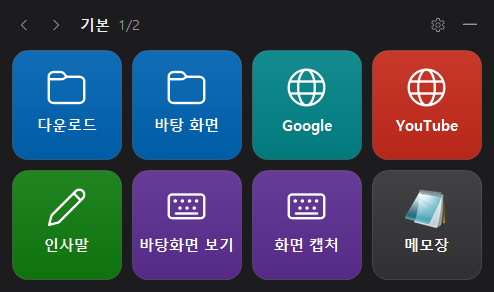
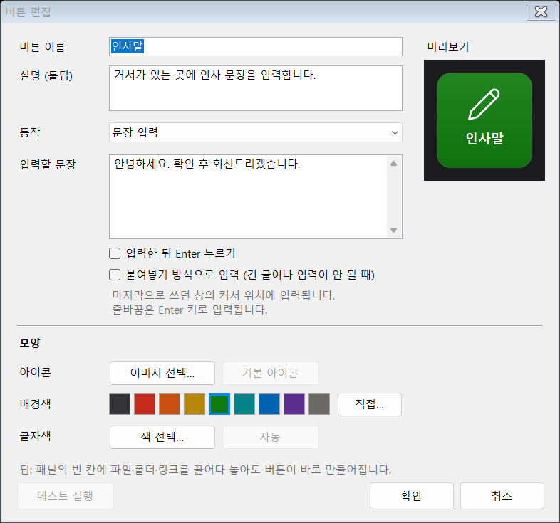
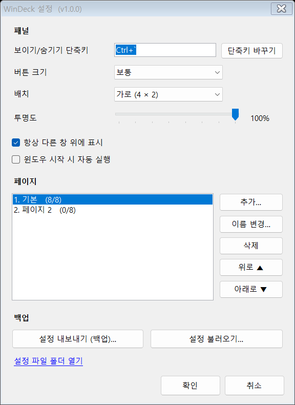

# WinDeck

스트림덱처럼 쓰는 윈도우용 8칸 버튼 패널. 화면에 항상 떠 있고, 버튼을 누르면 폴더·링크·프로그램을 열거나 지정한 문장·단축키를 입력함.



## 다운로드

> [!WARNING]
> **Microsoft Edge로는 설치되지 않습니다 (1.0.0 기준).**
> Chrome, 네이버 웨일, Firefox 등 다른 브라우저로 내려받으세요.

**[최신 버전 받기 (Releases)](../../releases/latest)**

| 파일 | 설명 |
|---|---|
| `WinDeck-Setup-x.y.z.exe` | 설치판 — 관리자 권한 없이 설치, 시작 메뉴 등록, Windows 설정 > 앱에서 제거 |
| `WinDeck-Portable-x.y.z.zip` | 포터블판 — 압축 풀고 `WinDeck.exe` 실행, 설정은 같은 폴더에 저장 |

- 요구 사항: Windows 10/11 (기본 내장 .NET Framework 4.8 사용, 추가 설치 없음)
- 처음 실행 시 "Windows의 PC 보호" 창이 뜨면 [추가 정보] → [실행] (코드 서명 인증서 없음)

> Elgato Stream Deck과 관련 없는 개인 프로젝트이며, 실물 기기 없이 화면에서 쓰는 프로그램. [MIT 라이선스](LICENSE)로 자유롭게 사용·수정·배포 가능.

## 1. 사용법

설치판은 시작 메뉴에서, 포터블판은 `WinDeck.exe` 더블클릭으로 실행 → 화면 오른쪽 아래에 패널 표시.

| 조작 | 동작 |
|---|---|
| 버튼 클릭 | 지정한 동작 실행 (성공 시 초록, 실패 시 빨강 테두리) |
| 버튼 우클릭 | 편집·복사·붙여넣기·비우기 메뉴 |
| 빈 칸 클릭 | 버튼 편집창 열림 |
| 마우스를 버튼 위에 올림 | 이름·설명·동작 내용 툴팁 표시 |
| 파일·폴더·링크를 빈 칸에 끌어다 놓기 | 버튼 자동 생성 |
| 상단 막대 끌기 | 패널 이동 (화면 가장자리에 자동 맞춤) |
| 패널 위 마우스 휠, ◀ ▶ | 페이지 넘기기 |
| ``Ctrl+` `` (Tab 바로 위 키) | 패널 숨기기/보이기 (설정에서 변경 가능) |
| 트레이 아이콘 클릭 | 패널 숨기기/보이기, 우클릭 시 메뉴 |

> 패널은 클릭해도 포커스를 가져가지 않음. 메모장·카톡·브라우저 등에 커서를 둔 채 패널 버튼을 누르면 그 자리에 바로 입력됨.

## 2. 버튼 동작 종류

| 동작 | 입력 예 | 비고 |
|---|---|---|
| 폴더 열기 | `C:\업무\자료`, `%USERPROFILE%\Documents` | 파일 경로를 넣으면 해당 폴더를 열고 파일 선택 |
| 링크 열기 | `naver.com`, `https://...`, `ms-settings:display` | `https://` 생략 가능 |
| 문장 입력 | 인사말·서명·자주 쓰는 답변 | 한글 지원, 입력 후 Enter 옵션, 붙여넣기 방식 옵션 |
| 단축키 실행 | `Win+D`, `Ctrl+Shift+Esc`, `Ctrl+A, Ctrl+C` | 쉼표로 여러 키 차례 입력, `단축키 바꾸기`로 녹화 |
| 프로그램·파일 실행 | `notepad.exe`, `C:\...\chrome.exe`, 바로가기(.lnk), 문서 | 실행 옵션(인수) 지정 가능, 프로그램 아이콘 자동 표시 |
| 페이지 이동 | 다른 페이지 선택 | 폴더처럼 버튼 묶음 전환 |
| 없음 | — | 이름표·구분용 |

버튼마다 이름, 설명(툴팁), 아이콘 이미지(PNG·JPG·ICO·exe 아이콘), 배경색, 글자색 지정 가능.



## 3. 설정 (패널의 ⚙ 또는 트레이 메뉴)

- 보이기/숨기기 단축키
- 버튼 크기 (작게·보통·크게·아주 크게), 배치 (가로 4×2 / 세로 2×4)
- 투명도, 항상 위에 표시
- 윈도우 시작 시 자동 실행
- 페이지 추가·이름 변경·삭제·순서 변경
- 설정 내보내기(백업) / 불러오기 — 아이콘까지 `.json` 파일 하나에 저장, 다른 PC로 이동 가능

설정 파일 위치: `%APPDATA%\WinDeck\config.json` (포터블판은 exe 옆 `WinDeckData\config.json`)
불러오기 직전 설정은 `%APPDATA%\WinDeck\backups\` 에 자동 보관.



## 4. 알려진 제한

- 관리자 권한으로 실행 중인 프로그램 창에는 문장·단축키 입력 불가 (Windows 보안 정책). 필요하면 WinDeck도 관리자 권한으로 실행.
- 일부 게임·원격 데스크톱 창은 문장 입력을 받지 않을 수 있음 → 버튼 편집에서 `붙여넣기 방식` 사용.
- 붙여넣기 방식은 클립보드를 잠시 사용한 뒤 약 0.8초 후 원래 내용으로 복원.
- `Ctrl+Alt+Del` 은 Windows 정책상 보낼 수 없음.
- Windows 11은 새 트레이 아이콘을 `^` 안에 숨김 → 설정 > 개인 설정 > 작업 표시줄 > 기타 시스템 트레이 아이콘에서 WinDeck 켜기.
- 기본 단축키는 ``Ctrl+` ``. `Ctrl+Tab` 은 브라우저 탭 전환과 겹치고, `Ctrl+Alt+Space` 는 다른 프로그램(Claude 앱 등)이 쓰는 경우가 있어 제외함. 등록한 단축키는 WinDeck 실행 중 다른 프로그램에 전달되지 않음 (예: VS Code의 ``Ctrl+` `` 터미널 열기).

## 5. 빌드

```bash
build.bat
```

Windows에 내장된 C# 컴파일러(`csc.exe`, .NET Framework 4.8)로 `dist\WinDeck.exe` 생성. Visual Studio 등 추가 설치 불필요.

자동 점검:

```bash
powershell -ExecutionPolicy Bypass -File tests\run-tests.ps1 -OutDir build\test-out
```

`-TypeTest`(테스트 창에 실제 입력), `-E2E`(별도 창 + 실제 마우스 클릭) 옵션 추가 가능. 점검 중에는 마우스·키보드 조작 금지.

## 6. 팀 배포

```bash
release.bat
```

`release\` 폴더에 두 파일 생성 (버전은 `src\AssemblyInfo.cs` 기준):

| 파일 | 용도 |
|---|---|
| `WinDeck-Setup-1.0.0.exe` | 설치판. 관리자 권한 불필요, 사용자별 설치(`%LOCALAPPDATA%\Programs\WinDeck`), 시작 메뉴·바탕 화면 바로가기, 자동 실행 선택, Windows 설정 > 앱에서 제거 |
| `WinDeck-Portable-1.0.0.zip` | 포터블판. 압축 해제 후 바로 실행, 설정은 같은 폴더의 `WinDeckData`에 저장 |

팀원용 안내문 `WinDeck 사용 안내.txt` 가 두 패키지에 함께 들어감 (원본: `deploy\`).

**팀 기본 버튼 세트**
1. 내 패널에서 팀 공용 버튼 구성 → 설정 > 설정 내보내기
2. 파일 이름을 `WinDeck.defaults.json` 으로 바꿔 `deploy\` 폴더에 넣기
3. `release.bat` 다시 실행 → 팀원이 처음 실행할 때 이 버튼 구성으로 시작 (이후에는 각자 수정한 설정 사용)

경로는 `%USERPROFILE%\Documents`, `\\서버\공유폴더` 처럼 누구 PC에서나 통하는 형태로 입력. `C:\Users\내이름\...` 경로는 동료 PC에 없음.

**업데이트 배포** (설치판을 덮어 설치하면 버튼 설정 유지, 실행 중인 WinDeck은 설치 중 자동 종료)
1. `src\AssemblyInfo.cs` 의 버전 숫자 변경, `CHANGELOG.md` 에 변경 내용 추가
2. `release.bat` 실행 → 변경 사항 커밋 후 `git push`
3. `release` 폴더에서 GitHub 릴리스 생성 (파일 이름만 쓸 것 — 전체 경로에 `#` 이 있으면 gh 가 표시 이름 구분자로 해석함)

```bash
gh release create v1.0.1 WinDeck-Setup-1.0.1.exe WinDeck-Portable-1.0.1.zip --title "WinDeck 1.0.1" --notes "변경 내용"
```

팀원 다운로드 주소는 항상 같음: <https://github.com/hopenesttt-prog/WinDeck/releases/latest>

**보안 경고**: 코드 서명 인증서가 없어 처음 실행 시 "Windows의 PC 보호" 창 표시 → [추가 정보] → [실행]. 일부 백신이 키 입력 기능 때문에 의심할 수 있음 — 사내 배포 시 IT 담당자에게 예외 등록 요청.

## 7. 파일 구조

| 경로 | 내용 |
|---|---|
| `src\Program.cs` | 시작점, 중복 실행 방지 |
| `src\DeckForm.cs` | 버튼 패널 (포커스 없는 창, 단축키, 트레이, 툴팁, 끌어놓기) |
| `src\ButtonEditForm.cs` | 버튼 편집창 |
| `src\SettingsForm.cs` | 설정창 |
| `src\ActionRunner.cs` | 폴더·링크·실행·문장·단축키 동작 실행 |
| `src\InputSender.cs` | 키 입력 전송 (SendInput, 붙여넣기) |
| `src\KeyCombo.cs` | 단축키 문자열 해석 |
| `src\Models.cs`, `src\ConfigStore.cs` | 설정 구조·저장·백업 |
| `src\KeyRenderer.cs`, `src\Controls.cs`, `src\Theme.cs` | 버튼 그리기·화면 요소 |
| `src\IconCache.cs`, `src\AppIcon.cs` | 버튼 아이콘, 프로그램 아이콘 |
| `src\Helpers.cs` | 자동 실행, 백업 대화상자, 폴더 선택창, 오류 기록 |
| `src\AssemblyInfo.cs` | 버전 정보 (배포 버전은 여기서 변경) |
| `installer\WinDeck.iss` | 설치 파일 스크립트 (Inno Setup 6) |
| `deploy\` | 팀원용 사용 안내문, (선택) 팀 기본 버튼 세트 |
| `release.ps1`, `release.bat` | 설치판·포터블판 생성 |
| `tests\` | 자동 점검 프로그램 |

## 라이선스

[MIT](LICENSE) © 2026 hopenesttt-prog — 사용·복사·수정·배포 자유, 단 저작권 표시와 라이선스 문구 유지. 프로그램은 "있는 그대로" 제공되며 어떤 보증도 하지 않음.
